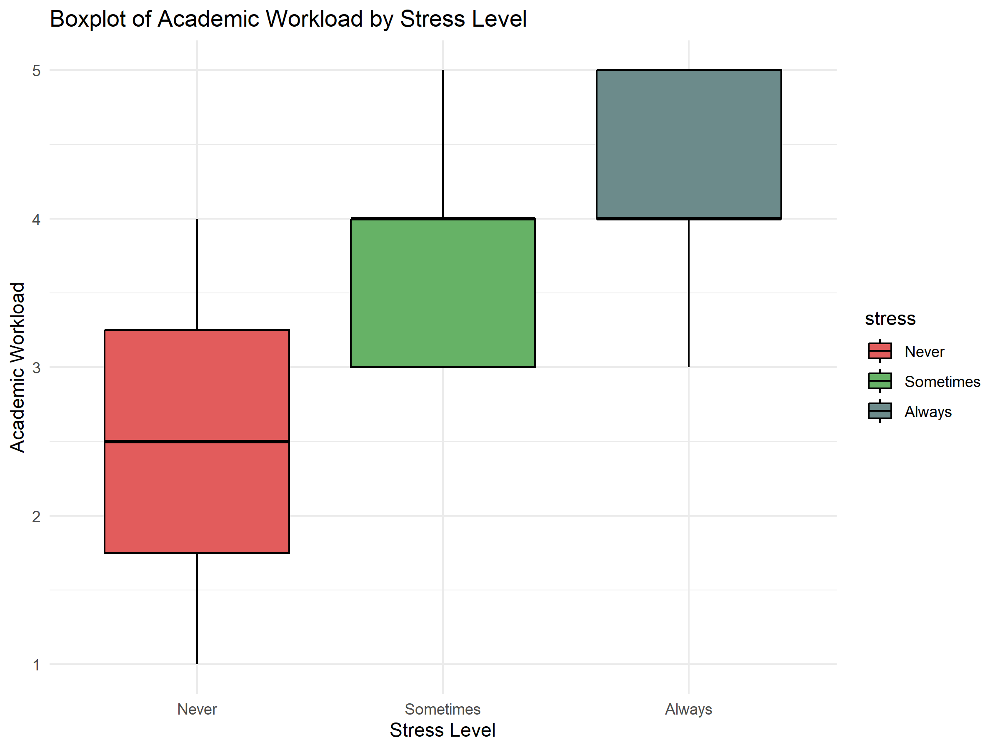
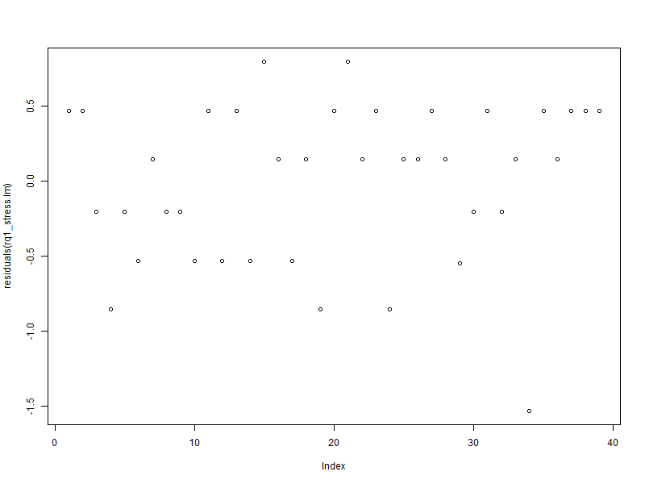
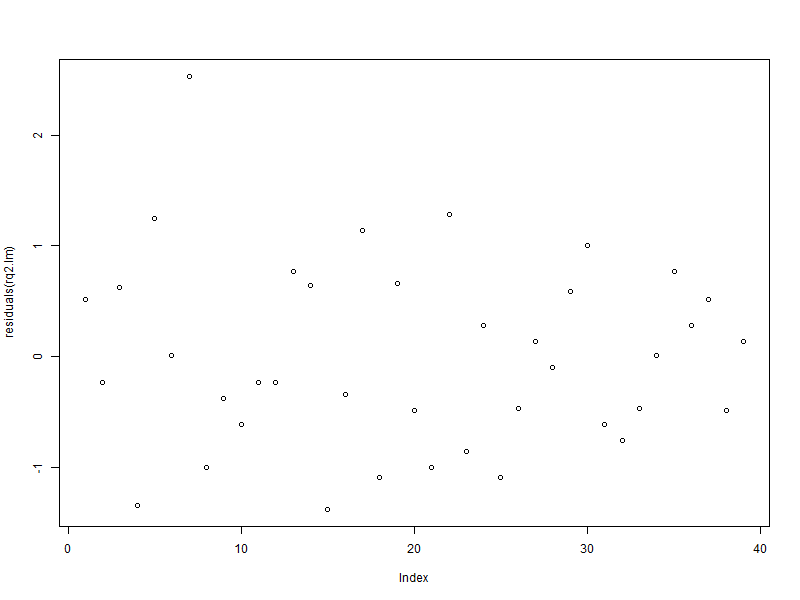
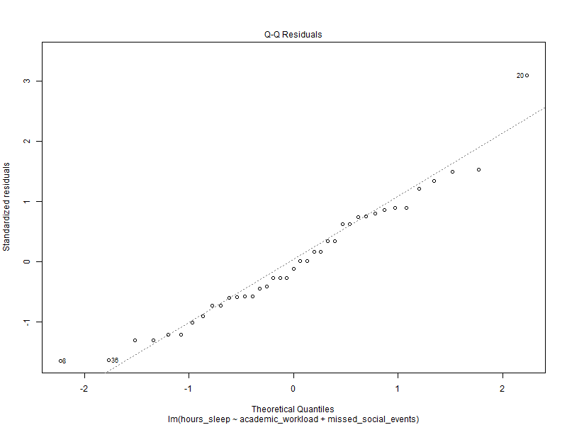
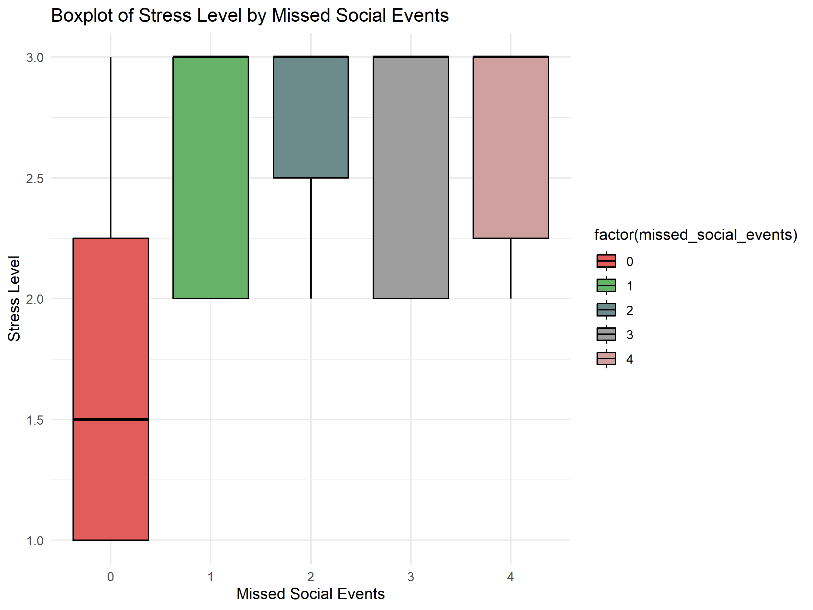
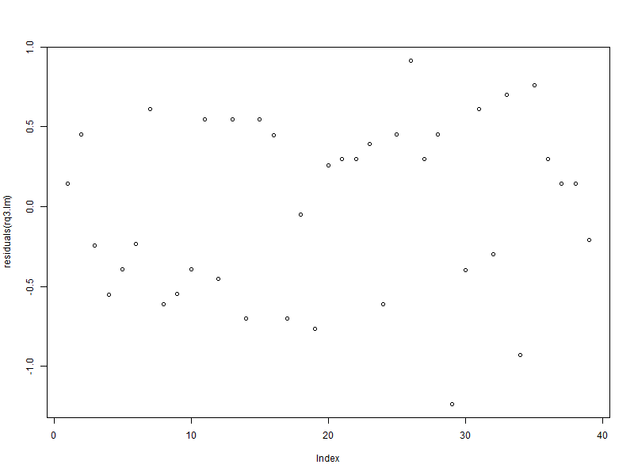

# Abstract

University students frequently face challenges that contribute to mental health issues such as stress and anxiety. This study examines the relationship between mental health and factors such as academic workload, hours of sleep, living situation, and work-life balance. Data were collected through a Google Form survey administered to students in a third-year statistics survey & sampling course, where participants rated their agreement with statements related to various mental health indicators. The results showed a significant relationship between academic workload and stress levels. While no significant relationship was found between stress levels and hours of sleep, we observed a significant association between hours of sleep and missed social events. Additionally, no statistically significant relationship was identified between stress levels and living situation, though a marginally significant relationship was found between living situation and missed social events. Since we were not able to reach most of the conclusions that we expected, we plan to consider other factors that might influence mental health, and also incorporate attention-check questions to identify rushed responses.

# Introduction

The academic workload faced by university students has increasingly become one of the critical variables for university students concerning mental health. Given a broader context of increasing academic challenges, many students experience heightened stress levels, which impact various aspects of their well-being, including sleep quality, work-life balance, and several mental health issues.

First, commonly reported mental health issues, including anxiety, depression and stress, have been found to correlate with academic pressures in highly competitive or rigorous programs where students may feel unable to meet academic and personal expectations (Beiter et al., 2015). 
Second, research indicates that students experiencing high academic workload tend to report poorer sleep quality and shorter sleep duration, which, in turn, can exacerbate mental health problems and academic performance challenges (Hershner & Chervin, 2014; Galambos et al., 2009). 
Third, students’ living environments and their ability to maintain a balanced lifestyle can also significantly impact mental health, since living in a more supportive and conducive environment positions students to better manage academic responsibilities and personal well-being (Kim & Koh, 2018).

Given the above potential factors, we seek to address the following research questions in this report:
- **Research Question 1:** Is there an association between students’ academic workload and the amount of mental health issues?
  - **Null Hypothesis:** There is no association between academic workload and the amount of mental health issues.
  - **Alternative Hypothesis:** There is a significant association between academic workload and the amount of mental health issues.

- **Research Question 2:** How does the academic workload affect the quality/length of sleep and its subsequent impact on students' mental health?
  - **Null Hypothesis:** Academic workload does not affect the quality or length of sleep, nor does it affect students' mental health.
  - **Alternative Hypothesis:** Academic workload significantly affects the quality and/or amount of sleep students get, which affects mental health.

- **Research Question 3:** Is mental health affected by students’ living situations or students’ ability to maintain work-life balance?
  - **Null Hypothesis:** Students' mental health is not affected by their living situation or their ability to maintain a work-life balance.
  - **Alternative Hypothesis:** Students' mental health is significantly affected by their living situation and their ability to maintain a work-life balance.


This study focuses on students enrolled in STA304H5 during Fall 2024, aiming to provide valuable insights into the effects of academic workload on their overall well-being. By exploring these relationships, the findings may inform strategies to enhance student support services and improve academic experiences.

# Methodology

# Data Collection

Between October 8th, 2024, and October 20th, 2024, the questionnaire's Google Form link was posted on the STA304H5 Piazza course discussion board. We utilized Simple Random Sampling (SRS) by using the R random generator to randomly sample 45 students from the received questionnaire responses. This method was chosen because it gives all respondents an equal chance of being included in the sample, making the sample representative. This experiment does not require methods like stratified or cluster sampling because the population in this experiment is relatively uniform and doesn’t need to be divided into strata or clusters.

We considered alternative methods, such as stratified sampling or cluster sampling. However, these methods are more suitable when the characteristics of specific subpopulations need to be accounted for. Since the characteristics of students taking STA304 were expected to be similar, we decided that it would not be meaningful to distinguish between the subpopulations. Since our goal was to capture the characteristics of all students, we determined that SRS was the most appropriate method for this experiment.

On the questionnaire, we asked participants to complete 10 short-answer questions inquiring about academic workload, average hours studied weekly, amounts of experienced stress-related symptoms (stress, anxiety, concentration difficulty), hours of sleep per night, current living situation, and experienced common issues caused by academic workload (time management, social life, financial).

## 1. Target Population

The target population consists of students enrolled in the STA304H5 course during the Fall 2024 semester.

## 2. Sampling Method

We will use **Simple Random Sampling (SRS)** by combining both sections of the STA304H5 course and selecting a random sample of students from the pool.

## 3. Variables of interest

The following variables were identified for the research:

### Academic Workload
Academic workload is defined as the number of assignments, projects, and exams and the overall demands of a course. The purpose of this study is to see if a high academic workload is associated with increased mental health problems, such as stress. Academic workload was measured through a questionnaire on a scale of 1 (very light), 2 (light), 3 (moderate), 4 (heavy) and 5 (very heavy).

### Living Situation
We divided students' living arrangements into four categories: Living alone, living with family, living with roommates, and living in on-campus housing. These living arrangements are important variables that have a significant impact on students' mental health and academic stress.

### Study Hours
Study time is an important indicator of students' time management and academic performance. This study analyzes the relationship between study time and mental health , exploring whether over studying leads to stress reduction or instead causes mental stress and anxiety. Study hours were measured by entering the number of hours of study per week.

### Mental Health Symptoms (Stress, Anxiety, and Concentration Difficulties)
These symptoms are key indicators of students' mental health and may be influenced by academic workload and living conditions. Understanding these relationships helps target interventions and support strategies to improve students' mental well-being. These symptoms were measured through a questionnaire on a scale of 1 (never) 2 (sometimes) and 3 (always).


## 4. Sample Size

In our research, we applied Simple Random Sampling (SRS) on 200 students.
Now, to find out the sample size using the bound of error as 0.29, we used the following formula for the width of confidence interval:
$$
D = \frac{B^2}{4}
$$

Where $B = 0.29$, giving:
$$
D = \frac{(0.29)^2}{4} = 0.021025
$$

Using the standard deviation ($\sigma$) of the academic workload variable, we computed the required sample size using the formula:
$$
n = \frac{N \times \sigma^2}{(N-1) \times D + \sigma^2}
$$
Where:

N = 200 (total population size)
B = 0.29 (bound of error)
D = B²/4 = 0.021025
$\sigma$ is approximated as (range of academic workload)/4
range = maximum academic workload - minimum academic workload

To randomize our sampling process, we used R's random sampling function sample() with a fixed seed (set.seed(1)) to randomly select participants from the full dataset based on the calculated sample size n.

# Analysis

## Section 1. ANOVA

RQ1 questions if academic workload contributes to a student’s stress levels. To answer this question, ANOVA (analysis of variance) is used to test the difference in average stress levels between students with different academic workloads. 
All our assumptions are satisfied as samples between the groups were randomly sampled and responses are independent from each other, data from each group is normally distributed (large sample size, n > 30) and variances are approximately the same (obtained p-value of 0.07758 from Barlett’s test, which is above the α = 0.05 significance level.) 
All categories were converted to categorical data to make them suitable for ANOVA testing.

# ANOVA between stress and academic workload

| Variable            | Degrees of Freedom (DF) | Sum of Squares (SS) | Mean Square (MS) | F-value | Pr(>F)         |
|---------------------|-------------------------|----------------------|------------------|---------|----------------|
| academic workload   | 3                       | 3.136                | 1.0455          | 4.273   | 0.0136         |
| Residuals           | 27                      | 6.605               | 0.2446           |         |                |

For the relationship between stress and academic workload, we divided the criteria of stress into categories of Never, Sometimes, and Always, and compared each group with an ANOVA test.
Since the calculated F-value of 5.121 is larger than the critical F-value of 2.874 at a 5% significance level with (3, 35) degrees of freedom, we reject the null hypothesis.
Therefore, there is a statistically significant relationship between student academic workload and levels of stress.


# ANOVA between stress and hours\_sleep

| Variable            | Degrees of Freedom (DF) | Sum of Squares (SS) | Mean Square (MS) | F-value | Pr(>F)         |
|---------------------|-------------------------|----------------------|------------------|---------|----------------|
| sleep               | 2                       | 1.242               | 0.6210          | 2.046   | 0.148           |
| Residuals           | 28                      | 8.500              | 0.3036          |         |                |

In the case of the relationship between Stress and Sleep, we ran an ANOVA test to convert sleep into categorical data, dividing it into 6 hours or less, between 6 and 8 hours, and more than 8 hours.
Since the calculated F-value of 0.163 is smaller than the critical F-value of 3.259 at the 5% significance level with (2, 36) degrees of freedom, we fail to reject the null hypothesis. 
Therefore, there is no statistically significant relationship between hours of sleep and levels of stress among students. This suggests that variations in hours of sleep do not significantly affect variations in stress levels.

# ANOVA between stress and missed social events

| Variable               | Degrees of Freedom (DF) | Sum of Squares (SS) | Mean Square (MS) | F-value | Pr(>F)         |
|------------------------|-------------------------|----------------------|------------------|---------|----------------|
| missed\_social\_events | 4                       | 1.220               | 0.3049           | 0.93   | 0.462          |
| Residuals              | 26                      | 8.522              | 0.3278           |         |                |
This relationship between stress and missed social events, we ran an ANOVA test to convert hours of study into categorical data, dividing into 0-10 hours as “Low”, 10-20 hours as “Medium” and 20 or more as “High”.
Since the calculated F-value was 1.092 and this is less than the critical value, 2.629 (df=4, df=34). 
Therefore, we fail to reject the null hypothesis. This means that **stress levels** and **missed social events** do not have a significant relationship.

Since the calculated F-value of 1.092 is smaller than the critical F-value of 2.649 at the 5% significance level with (4, 34) degrees of freedom, we fail to reject the null hypothesis. This conclusion is also supported by the p-value of 0.376, which is greater than the significance level of 0.05. Therefore, there is no statistically significant relationship between stress levels and missed social events among students.

# Section 2. Chi-square Test of Independence
Research Question 1 questions if there is a relationship between the academic workload of a student and their mental health. Research question 3 questions if there is a relationship between students' living situation or ability to maintain work-life balance. Our assumption that the data is randomly sampled holds given our method of sampling outlined above.
To prove that there exists a relationship between these variables, we want to use the chi square test of independence. We use $\alpha = 0.05$ as the significance level.

# Chi Square Test between Academic Workload and Stress
$X^2 = 25.936$, *df* = 6, *p-value* = 0.0002288

Since the calculated *p-value* was 0.0002288 and is less than $\alpha = 0.05$, we reject the null hypothesis. This indicates that there is a significant association between academic workload and the stress levels of a student.


Since the calculated p-value was 0.0002288 and is less than a=0.05, we reject the null hypothesis. This means that the academic workload and the 
stress levels of a student are related.

# Chi Square Test between Academic Workload and Anxiety
$X^2 =14.113$,*df*=6, *p-value* =0.0284


Since the calculated *p-value* was 0.0284 and is less than $\alpha = 0.05$, we reject the null hypothesis. There is enough statistical evidence that there is a significant association between the academic workload and the anxiety levels of a student.

# Chi Square Test between Academic Workload and Concentration
$X^2 =6.5$, *df*=6, *p-value* =0.3696


Since the calculated p-value was 0.3696 and is greater than $\alpha = 0.05$, we fail to reject the null hypothesis. There isn't enough statistical evidence to indicate that the academic workload and the 
The concentration levels of a student are related.

# Chi Square Test between Living Situation and Stress
$X^2 =4.9936$, *df*=6, *p-value* =0.5446


Since the calculated *p-value* was 0.5446 and is greater than $\alpha = 0.05$, we fail to reject the null hypothesis. There isn't enough statistical evidence that the living situation and the stress levels of a student are related.


# Chi Square Test between Living Situation and Anxiety
$X^2=6.6042$, *df*=6, *p-value* =0.359


Since the calculated p-value was 0.359 and is greater than a=0.05, we fail to reject the null hypothesis. There isn't enough statistical evidence that the living situation and the anxiety levels of a student are related.

# Chi Square Test between Living Situation and Concentration
X-squared =2.8773, df=6, p-value =0.8241

Since the calculated p-value was 0.8241 and is greater than $\alpha=0.05$, we fail to reject the null hypothesis.  There isn't enough statistical evidence that the living situation and the concentration levels of a student are related.

# Chi Square Test between Time Management and Stress
X-squared =10.894, df=8, p-value =0.2078

Since the calculated p-value was 0.2078 and is greater than $\alpha=0.05$, we fail to reject the null hypothesis.  There isn't enough statistical evidence that the time management skills and the stress levels of a student are related.

# Chi Square Test between Time Management and Anxiety
X-squared =6.5567, df=8, p-value =0.5851

Since the calculated p-value was 0.5851 and is greater than $\alpha=0.05$, we fail to reject the null hypothesis.  There isn't enough statistical evidence that the time management skills and the anxiety levels of a student are related.

# Chi Square Test between Time Management and Concentration
X-squared =9.3321, df=8, p-value =0.3151

Since the calculated p-value was 0.3151 and is greater than $\alpha=0.05$, we fail to reject the null hypothesis.  There isn't enough statistical evidence that the time management skills and the concentration levels of a student are related.

# Chi Square Test between Financials and Stress
X-squared =9.3321, df=8, p-value =0.7223

Since the calculated p-value was 0.3151 and is greater than $\alpha=0.05$, we fail to reject the null hypothesis.  There isn't enough statistical evidence that the financial situation and the stress levels of a student are related.

# Chi Square Test between Financials and Anxiety
X-squared =5.3134, df=8, p-value =0.7236

Since the calculated p-value was 0.7236 and is greater than $\alpha=0.05$, we fail to reject the null hypothesis.  There isn't enough statistical evidence that the financial situation and the anxiety levels of a student are related.

# Chi Square Test between Financials and Concentration
X-squared =6.1471, df=8, p-value =0.6308

Since the calculated p-value was 0.6308 and is greater than $\alpha=0.05$, we fail to reject the null hypothesis.  There isn't enough statistical evidence that the financial situation and the concentration levels of a student are related.
# Section 3. Simple and Multiple Linear Regressions
This part of the analysis focuses on applying linear regression to address the three research questions outlined in the introduction. We will explore whether there is a relationship between students' academic workload and the prevalence of mental health issues; between academic workload, the amount of sleep students get, and its impact on mental health; and finally, between mental health, students' living situations, and their ability to maintain a work-life balance. All of these relationships were found to be statistically significant.

## Research Question 1

### a. Relevant Graphs & Tables
Research Question 1 is concerned with determining whether there is a relationship between students’ academic workload and the prevalence of mental health issues in students. To answer this question, we start by plotting a boxplot of academic workload by stress level. This plot suggests that higher stress levels are associated with a higher academic workload. On average, students who "Always" or "Sometimes" feel stressed tend to have a higher workload than those who "Never" feel stressed. 

```{r, echo=FALSE, message=FALSE, warning=FALSE, fig.align='center'}
# Load packages
library(ggplot2)
library(grid)

# Data loading and preprocessing
my_data <- read.csv("STA304 Group Project Dataset.csv", header = TRUE, sep = ",")

# Remove unnecessary column
my_data$X <- NULL

# Remove outlier rows (if necessary)
my_data <- my_data[-c(3, 12), ]

# Calculate sample size
N <- nrow(my_data)
B <- 0.29
D <- (B^2) / 4
sigma <- (max(my_data$academic_workload) - min(my_data$academic_workload)) / 4
n <- ceiling((N * sigma^2) / ((N - 1) * D + sigma^2))

# Sampling
set.seed(1)
sample_data <- my_data[sample(nrow(my_data), n), ]

# Variable transformations and boxplot creation
sample_data$stress <- factor(sample_data$stress, levels = c("Never", "Sometimes", "Always"))
sample_data$stress_numeric <- as.numeric(sample_data$stress) # Or use as.numeric(factor(...)) if order is important

boxplot_plot <- ggplot(sample_data, aes(x = stress, y = academic_workload, fill = stress)) +
  geom_boxplot(color = "black") +
  scale_fill_manual(values = c("Never" = "#E25C5C", "Sometimes" = "#66B266", "Always" = "#6C8B8B")) +
  labs(title = "Boxplot of Academic Workload by Stress Level",
       x = "Stress Level",
       y = "Academic Workload") +
  theme_minimal() +
  theme(legend.position = "none")

print(boxplot_plot)
grid.rect(gp = gpar(fill = NA, col = "black", lwd = 4))

# Save the plot as a PNG file
# ggsave("boxplot_academic_workload_by_stress.png", plot = boxplot_plot, width = 8, height = 6, dpi = 300)
```

<!-- {width=80%} -->

### b. Necessary Assumptions
To confirm this association, we implement a simple linear regression model, where the dependent variable is stress_numeric (the stress variable, converted to numeric values), and the independent variable is academic_workload. To implement this model, we check the following assumptions using the following plot of the residuals:

```{r, include = FALSE}
# Research Question 1 - Simple Linear Regression
rq1_stress.lm = lm(stress_numeric ~ academic_workload, data = sample_data)
summary(rq1_stress.lm)
```
```{r, echo = FALSE, fig.align = "center"}
# Assumptions for Research Question 1 - Simple Linear Regression
par(mar = c(3, 3, 2, 2))
plot(residuals(rq1_stress.lm))
```

<!-- {width=80%} -->

 1. Independence of errors: Since the plot has no noticable pattern, the independence assumption is satisfied.
 2. Normality of errors: Since our sample size is sufficiently large, by the Central Limit Theorem the sample mean (and by extension, the sampling distribution of residuals) approximately follows a Normal distribution. 
 3. Homogeneity of variances amongst errors: Since the residuals plot has a "horizontal band appearance", this suggests that variance of the residuals are the same for all values of the independent variable academic_workload.

 Since all the assumptions are met, we may preform the regression analysis.

### c. Computation and Statistical Test Output
The regression analysis produced the following results:

| Statistic                  | Estimate   | SE       | t-value | p-value |
|----------------------------|------------|----------|---------|---------|
| Intercept ($\beta_0$)      | 1.22389    | 0.40942  | 2.989   | 0.00495 |
| Slope ($\beta_1$)          | 0.32655    | 0.09945  | 3.284   | 0.00224 |

---

The residual standard error is $0.5353$ with $37$ degrees of freedom. The $R^2$ value is $0.2256$, and the F-statistic is $F(1, 37) = 10.78$, with a p-value of $0.002$.


The equation of the regression line is given by:
$$
\text{Stress} = 1.22389 + 0.32655 \cdot \text{Academic Workload}
$$

### d. Interpretation
The small $p-value = 0.00224$ indicates that academic workload is a significant predictor of stress. Therefore, we can conclude that there is a significant relationship between students' academic workload and their stress levels.

## Research Question 2

### a. Relevant Graphs & Tables
Research Question 2 investigates whether there is a relationship between students’ academic workload, the amount of sleep they get, and impact on mental health. Since the ANOVA above showed no significant relationship between stress and hours of sleep, we investigate the effect of another factor, the number of missed social events. To begin, we plot a boxplot of hours of sleep by the number of missed social events. This plot suggests students who miss more social events tend to have fewer hours of sleep on average.


```{r, echo = FALSE, fig.align = "center"}


# Research Question 2 - Boxplot
boxplot_plot <- ggplot(sample_data, aes(x = factor(missed_social_events), y = hours_sleep, fill = factor(missed_social_events))) +
  geom_boxplot(color = "black") +
  scale_fill_manual(values = c("0" = "#E25C5C", "1" = "#66B266", "2" = "#6C8B8B", "3" = "#9E9E9E", "4" = "#D0A0A0")) +
  labs(title = "Boxplot of Hours of Sleep by Missed Social Events",
       x = "Missed Social Events",
       y = "Hours of Sleep") +
  theme_minimal() +
  theme(legend.position = "none")
  
print(boxplot_plot)
grid.rect(gp = gpar(fill = NA, col = "black", lwd = 4))

# Save the plot as a PNG file
# ggsave("boxplot_hours_sleep_by_missed_social_events.png", plot = boxplot_plot, width = 8, height = 6, dpi = 300)
```

<!-- {width=80%} -->

### b. Necessary Assumptions
To assess this relationship, we use a multiple linear regression model with hours of sleep as the dependent variable, and academic workload and missed social events as the independent variables. Before interpreting this model, we check the following assumptions:

```{r, include = FALSE}
# Research Question 2 - Multiple Linear Regression
rq2.lm = lm(hours_sleep ~ academic_workload + missed_social_events, data = sample_data)
summary(rq2.lm)
```
```{r, echo = FALSE, fig.align = "center"}
# Assumptions for Research Question 2 - Multiple Linear Regression
par(mar = c(3, 3, 2, 2))
plot(residuals(rq2.lm))
```
```{r, echo = FALSE, fig.align = "center"}
# Assumptions for Research Question 2 - Multiple Linear Regression
par(mar = c(3, 3, 2, 2))
plot(rq2.lm, which=2)
```

<!-- {width=80%}
{width=80%} -->

1. Independence of errors: The residual plot shown above indicates no clear patterns, which suggests independence.
2. Normality of errors: Since the sample size is large, the Central Limit Theorem implies that the residuals should approximate a normal distribution. Also, a QQ-plot confirms approximate normality.
3. Homogeneity of variances: The residuals plot exhibits a roughly horizontal band, indicating constant variance across predicted values.
4. No multi-collinearity: We calculated the VIF of each independent variable, and found that $VIF(\text{academic\_workload}) = 1.076844$, and $VIF(\text{missed\_social\_events}) = 1.076844$. Since they are both less than $5$, this indicates there is little correlation between them.

```{r, include = FALSE}
# Assumptions for Research Question 2 - Multiple Linear Regression
library(car)
vif(rq2.lm)
```

With all assumptions adequately met, we proceed with the regression analysis.

### c. Computation and Statistical Test Output
The regression analysis produced the following results:

| Statistic                  | Estimate   | SE       | t-value | p-value |
|----------------------------|------------|----------|---------|---------|
| Intercept ($\beta_0$)       | 8.5521     | 0.6661   | 12.838  | $5.3 \times 10^{-15}$ |
| Slope 1 ($\beta_1$)         | -0.1412    | 0.1666   | -0.848  | 0.40208 |
| Slope 2 ($\beta_2$)         | -0.3763    | 0.1194   | -3.151  | 0.00327 |

---

The residual standard error is $0.864$ with $36$ degrees of freedom. The $R^2$ value is $0.2653$, the adjusted $R^2$ is $0.2245$, and the F-statistic is $F(2, 36) = 6.5$, with a p-value of $0.003889$.

The equation of the regression line is given by:
$$
\text{Hours of Sleep} = 8.5521 − 0.1412 \cdot \text{Academic Workload} - 0.3763 \cdot \text{Missed Social Events}
$$

### d. Interpretation
The output of the regression analysis shows that the missed social events has a statistically significant negative association with hours of sleep ($p = 0.00327$). However, academic workload does not have a significant relationship with hours of sleep ($p = 0.40208$).

## Research Question 3

### a. Relevant Graphs & Tables
Research Question 3 examines whether mental health, represented by stress levels, is affected by students’ living situations and their ability to maintain a work-life balance. To explore this relationship, we first plot a boxplot of stress level by missed social events, with students grouped by stress categories ("Always," "Never," and "Sometimes"). This plot suggests that students who miss social events "Always" or "Sometimes" have higher stress levels, while those who "Never" miss social events report lower stress levels.

```{r, echo = FALSE, fig.align = "center"}

# Research Question 3 - Boxplot
boxplot_plot <- ggplot(sample_data, aes(x = factor(missed_social_events), y = stress_numeric, fill = factor(missed_social_events))) +
  geom_boxplot(color = "black") +
  scale_fill_manual(values = c("0" = "#E25C5C", "1" = "#66B266", "2" = "#6C8B8B", "3" = "#9E9E9E", "4" = "#D0A0A0")) +
  labs(title = "Boxplot of Stress Level by Missed Social Events",
       x = "Missed Social Events",
       y = "Stress Level") +
  theme_minimal() +
  theme(legend.position = "none")

print(boxplot_plot)
grid.rect(gp = gpar(fill = NA, col = "black", lwd = 4))

# Save the plot as a PNG file
# ggsave("boxplot_missed_social_events_by_stress.png", plot = boxplot_plot, width = 8, height = 6, dpi = 300)
```

<!-- {width=80%} -->

### b. Necessary Assumptions
To investigate the impact of missed social events and living situations on stress, we use a multiple linear regression model. The response variable is stress (in numeric form), and the predictors are missed social events and living situation. We verify the following assumptions:

```{r, include = FALSE}
# Research Question 3 - Multiple Linear Regression
rq3.lm <- lm(stress_numeric ~ missed_social_events + living_situation, data = sample_data)
summary(rq3.lm)
```
```{r, echo = FALSE, fig.align = "center"}
# Assumptions for Research Question 3 - Multiple Linear Regression
par(mar = c(3, 3, 2, 2))
plot(residuals(rq3.lm))
```
```{r, echo = FALSE, fig.align = "center"}
# Assumptions for Research Question 3 - Multiple Linear Regression
par(mar = c(3, 3, 2, 2))
plot(rq3.lm, which=2)
```

<!-- {width=80%}
{width=80%} -->

1. Independence of errors: The residual plot indicates no clear patterns, suggesting that the errors are  independent.
2. Normality of errors: Since the sample size is large, the Central Limit Theorem implies that the residuals should approximate a normal distribution. Also, a QQ-plot confirms approximate normality.
3. Homogeneity of variances: The residuals plot exhibits a roughly horizontal band, indicating constant variance across predicted values.
4. No multi-collinearity: We calculated the VIF of each independent variable, and found that $VIF(\text{missed\_social\_events}) = 1.009045$, and $VIF(\text{living\_situation}) = 1.003006$. Since both VIF values are close to $1$, there’s no indication of multicollinearity in this model.

```{r, include = FALSE}
# Assumptions for Research Question 3 - Multiple Linear Regression
library(car)
vif(rq3.lm)
```

With all assumptions adequately met, we proceed with the regression analysis.

### c. Computation and Statistical Test Output
The regression analysis produced the following results:

| Statistic                  | Estimate   | SE       | t-value | p-value |
|----------------------------|------------|----------|---------|---------|
| Intercept ($\beta_0$)       | 1.93006    | 0.27980  | 6.898   | $6.02 \times 10^{-8}$ |
| Slope 1 ($\beta_1$)         | 0.15560    | 0.07721  | 2.015   | 0.0518 |
| Slope 2 ($\beta_2$)         | 0.81061    | 0.39928  | 2.030   | 0.0502 |
| Slope 3 ($\beta_3$)         | 0.21206    | 0.28310  | 0.749   | 0.4590 |
| Slope 4 ($\beta_4$)         | 0.30493    | 0.25406  | 1.200   | 0.2383 |

---

The residual standard error is $0.5745$ with $34$ degrees of freedom. The $R^2$ value is $0.1806$, the adjusted $R^2$ value is $0.08416$, and the F-statistic is $F(4, 34) = 1.873$, with a p-value of $0.1378$.

The equation of the regression line is given by:
$$
\begin{array}{lllllll}
\text{Stress} &=& 1.93006 &+& 0.15560 \cdot \text{Missed Social Events} &+& 0.81061 \cdot \text{Living On Campus} \\
              & &         &+& 0.21206 \cdot \text{Living With Family}   &+& 0.30493 \cdot \text{Living With Roommates}
\end{array}
$$

### d. Interpretation
The results indicate that missed social events are a marginally significant predictor of stress levels ($p = 0.0518$). Living situation, specifically living on campus, is also a marginally significant predictor ($p = 0.0502$). However, living with family ($p = 0.4590$) and living with roommates ($p = 0.2383$) do not significantly predict stress. 

# Discussion and Results

For Research Question 1, we wished to investigate whether there is a relationship between a student's academic workload and the prevalence of mental health issues in students. Preliminarily, we plotted a boxplot to look for any potential relationship between the two variables, and we found that on average, students with higher stress levels tend to have a higher academic workload. We later confirmed this with the simple linear regression test and found that academic workload is a significant predictor of stress.

For Research Question 2, we aimed to investigate whether there is a relationship between students' academic workload and the amount of sleep they get each night. An earlier test indicated no significant relationship between hours of sleep and academic workload. Therefore, we decided to examine the effect of another factor: the number of social events a student misses on their hours of sleep. Initially, we plotted a boxplot of hours of sleep against the number of missed social events. The graph suggested that, on average, the more social events a student misses, the fewer hours of sleep they tend to get. Our analysis confirmed the earlier finding that academic workload does not have a significant relationship with hours of sleep but also revealed a strong relationship between the number of missed social events and students' daily hours of sleep.

For Research Question 3, we studied whether mental health is affected by students' living situations and their ability to maintain a work-life balance. To explore this relationship, we first plotted a boxplot of stress against the number of missed social events. The plot suggested that students who sometimes or always miss social events tend to experience more stress, while those who never miss social events experience less stress. Then, we ran a test that concluded missing social events and living on campus may slightly affect stress levels, although the evidence is not very strong. In contrast, living with family or roommates does not appear to have a significant impact on stress.

ANOVA test between stress and academic workload has the calculated F-value of 4.273, which is larger than the critical F-value of 2.960 at the 5% significance level with (3, 27) degrees of freedom. Therefore, we reject the null hypothesis. There is a statistically significant relationship between student academic workload and levels of stress. This suggests that variations in academic workload are significantly related to variations in stress.

ANOVA test between stress and hours of sleep has the calculated F-value of 0.163, which is smaller than the critical F-value of 3.340 at the 5% significance level with (2, 28) degrees of freedom. Therefore, we fail to reject the null hypothesis. There is no statistically significant correlation between hours of sleep and levels of stress among students. This suggests that variations in hours of sleep do not significantly relate to variations in stress levels.

ANOVA test between stress and missed social events has the calculated F-value of 1.092, which is smaller than the critical F-value of 2.649 at the 5% significance level with (4, 34) degrees of freedom. Therefore, we fail to reject the null hypothesis. This means that stress levels and missed social events do not have a significant relationship.

For the chi square tests of independence between academic workload and stress, anxiety, the respective p values are 0.0002288 and 0.0284 which are both less than the alpha a=0.05, so we reject the null hypothesis. For the chi square tests of independence between academic workload and concentration, the p value is 0.3696, which is greater than the alpha a=0.05, therefore we fail to reject the null hypothesis. This suggests that a student's academic workload has and on their stress or anxiety but not their concentration . 

Chi square tests between students' living situation and their stress, anxiety and concentration yield p values of 0.5446, 0.359, and 0.8241 respectively. All of these p values are greater than the alpha a=0.05, therefore we fail to reject the null hypothesis for all three of these chi square tests. This suggests that the living situation of a student doesn't have an association with their stress, anxiety and concentration. 

Chi square tests between students' time management skills and their stress, anxiety and concentration yield p values of 0.2078, 0.5851, and 0.3151 respectively. All of these p values are greater than the alpha a=0.05, therefore we fail to reject the null hypothesis for all three of these chi square tests. This suggests that a student's ability to manage their time doesn't have an association with their stress, anxiety and concentration. 

Chi square tests between students' financials and their stress, anxiety and concentration yield p values of 0.7223, 0.7236, and 0.6308 respectively. All of these p values are greater than the alpha a=0.05, therefore we fail to reject the null hypothesis for all three of these chi square tests. This suggests that a student's financial situation doesn't have an association with their stress, anxiety and concentration. 

The results of the multiple and linear regression tests indicate that missed social events are a marginally significant predictor of stress levels (p = 0.0518). Living situation, specifically living on campus, is also a marginally significant predictor (p = 0.0502). However, living with family (p = 0.4590) and living with roommates (p = 0.2383) do not significantly predict stress. 

Overall, the results of this study show that stress and anxiety among university students is primarily related to academic factors, with lifestyle factors such as sleep and socializing having less of an impact than expected.

# 6. Limitations

Three major limitations that our study faced were failing to reject the null hypotheses, survey limitations, and the indirect nature of our research.

1. Failing to Reject Null Hypotheses \
Many additional tests not included in this report failed to produce statistically significant results. For example, one linear regression test concluded that there is no relationship between academic workload and some mental health issues. This sort of result seemed counterintuitive and difficult to accept, which suggested there might be other factors that influence mental health that we did not consider.

2. Survey Limitations \
Students may have rushed through the survey in order to receive course credit, without taking the time to reflect on their responses. Also, students may have not felt comfortable answering questions about their mental health truthfully, which could have led to response bias. 


3. Indirect Nature of Research \
Mental health is a complex topic, and it is difficult to be certain about the reliability and validity of our results when our study relied on indirect measures such as stress and anxiety to represent the broad spectrum of mental health.
  
In the future, to address these limitations, we plan to incorporate attention-check questions to identify rushed or careless responses. We will also explore additional variables that may influence mental health to ensure a comprehensive understanding of the complexities of mental health. Finally, some open-ended questions could help students elaborate on their responses.

# 7. Conclusion 

The linear regression analysis conducted for the three research questions of this study provides valuable insights into the factors affecting student stress and mental health. For Research Question 1, we found a significant positive relationship between academic workload and stress levels, suggesting that students with heavier workloads tend to experience higher levels of stress. In Research Question 2, while academic workload did not significantly impact the amount of sleep, missed social events were found to significantly reduce hours of sleep, which may contribute to poor mental health. For Research Question 3, missed social events and living situations were marginally significant predictors of stress, indicating that students who miss social events or live on campus tend to report higher stress levels. These findings highlight the importance of considering multiple factors in understanding a student's overall well-being. However, the limitations of this analysis, including potential issues with sample randomization and measurement quality, should be addressed in future research to enhance the robustness and accuracy of the results. Future studies should also explore other possible variables, such as social support and coping mechanisms, which may further explain the mental health challenges faced by students.


Overall, the results of the ANOVA tests show that the stress levels of the students sampled are primarily related to academic factors, with lifestyle factors such as sleep and socializing having less of an impact on their mental health than expected. In addition, this voluntary response method was likely to result in selection bias.

For the chi square tests of independence between academic workload and stress, anxiety, the respective p values are 0.0002288 and 0.0284 which are both less than the alpha a=0.05, so we retain the null hypothesis. For the chi square tests of independence between academic workload and concentration, the p value is 0.3696, which is greater than the alpha a=0.05, therefore we reject the null hypothesis. This suggests that a student's academic workload has an effect on their concentration but not their stress or anxiety. 

The linear regression analysis conducted for the three research questions of this study provides valuable insights into the factors affecting student stress and mental health. For Research Question 1, we found a significant positive relationship between academic workload and stress levels, suggesting that students with heavier workloads tend to experience higher levels of stress. In Research Question 2, while academic workload did not significantly impact the amount of sleep, missed social events were found to significantly reduce hours of sleep, which may contribute to poor mental health. For Research Question 3, missed social events and living situations were marginally significant predictors of stress, indicating that students who miss social events or live on campus tend to report higher stress levels. These findings highlight the importance of considering multiple factors in understanding a student's overall well-being. However, the limitations of this analysis, including potential issues with sample randomization and measurement quality, should be addressed in future research to enhance the robustness and accuracy of the results. Future studies should also explore other possible variables, such as social support and coping mechanisms, which may further explain the mental health challenges faced by students.

Chi square tests between students' financials and their stress, anxiety and concentration yield p values of 0.7223, 0.7236, and 0.6308 respectively. All of these p values are greater than the alpha a=0.05, therefore we reject the null hypothesis for all three of these chi square tests. This means that a student's financial situation has some effect on their stress, anxiety and concentration.

Overall, the results of the chi square tests of independence indicate that the mental health of a student is primarily related to lifestyle factors, with the academic workload only being related to students' concentration.

# 8. Limitations

## Limitations
This experiment investigated the relationship between academic workload, stress, sleep, and work life-balance among STA304 students. There were many difficulties and limitations in conducting this experiment.

### Sampling
First, we used Simple Random Sampling (SRS) to sample the responses from the survey, but I am not sure that randomness was guaranteed. Certain students may have been more active in the survey, which may not generalize the results. Therefore, I think that various methods such as stratified sampling should be used instead of SRS. Also, there is a question of voluntariness, because the students did not voluntarily participate in the survey, but responded as part of their course participation.

### Questionnaire Design
We think that personal bias may occur due to the ambiguity of the questions in the questionnaire, such as the mental health questions, because they are not objective parameters that can be subjective to the people who answer them. These parameters were measured indirectly in the questionnaire, but this can increase the likelihood of measurement error.

### Sample Size
Third, there is the issue of sample size: while the sample size of this experiment is relatively large compared to the population, the population itself may be limited and the findings may not be generalizable. We would expect the results to be more generalizable if the experiment were conducted on a larger population. A larger population would also allow for us to assume that all of our categorical groups have a normal population distribution, one of the assumptions needed for our ANOVA testing.


## 9. Conclusion

The linear regression analysis conducted for the three research questions of this study provides valuable insights into the factors affecting student stress and mental health. For Research Question 1, we found a significant positive relationship between academic workload and stress levels, suggesting that students with heavier workloads tend to experience higher levels of stress. 

In Research Question 2, while academic workload did not significantly impact the amount of sleep, missed social events were found to significantly reduce hours of sleep, which may contribute to poor mental health. 

For Research Question 3, missed social events and living situations were marginally significant predictors of stress, indicating that students who miss social events or live on campus tend to report higher stress levels. These findings highlight the importance of considering multiple factors in understanding a student's overall well-being.

However, the limitations of this analysis, including potential issues with sample randomization and measurement quality, should be addressed in future research to enhance the robustness and accuracy of the results. Future studies should also explore other possible variables, such as social support and coping mechanisms, which may further explain the mental health challenges faced by students.

We also conducted ANOVA testing for the three research questions for this study. 

Research question 1 (RQ1), questions if academic workload contributes to a student’s stress levels. The results of the ANOVA test between the variables, stress and academic_workload also suggested that there is a significant relationship between a student's academic workload and levels and stress. 

Next, the ANOVA test for the second research question, if a student’s mental health is affected by their quality of sleep, suggested that there is not enough evidence to imply that there is a relationship between the variables hours_sleep and stress.

Finally, the ANOVA test for RQ3 gave us insight on whether a student’s mental health is affected by their ability to keep a work-life balance. The results of this analysis did not show evidence pointing towards a significant relationship between the variables, missed_social_events and stress. 

Future and further research would greatly benefit from having a larger population size, since we could not go with the assumption that each group has a normal population distribution in each categorical group, since the CLT could not be satisfied due to the fact that each group did not have more than 30 observations.


## 10. Documentation of AI Tool Usage

We utilized generative AI tools, namely ChatGPT, to help refine our ideas and improve readability. These tools were used primarily for brainstorming, grammar corrections, and the explanations of certain sections. However, all the analytical work, including statistical methods and interpretation of results, was done by the authors.

https://chatgpt.com/share/674a3a7d-83e4-8013-a381-4192bb2028da


1. Beiter, R., Nash, R., McCrady, M., Rhoades, D., Linscomb, M., Clarahan, M., & Sammut, S. (2015). The prevalence and correlates of depression, anxiety, and stress in a sample of college students. *Journal of Affective Disorders*, 173(3), 90-96.
2. Galambos, N. L., Howard, A. L., & Krahn, H. J. (2009). Work, stress, and academic performance in university students. *Journal of Youth and Adolescence*, 38(4), 490-503.
3. Hershner, S. D., & Chervin, R. D. (2014). Causes and consequences of sleepiness among college students. *Nature and Science of Sleep*, 6, 73-84.
4. Kim, E., & Koh, K. (2018). Work-life balance and well-being among college students: A critical literature review. *Journal of College Counseling*, 21(3), 247-261.
